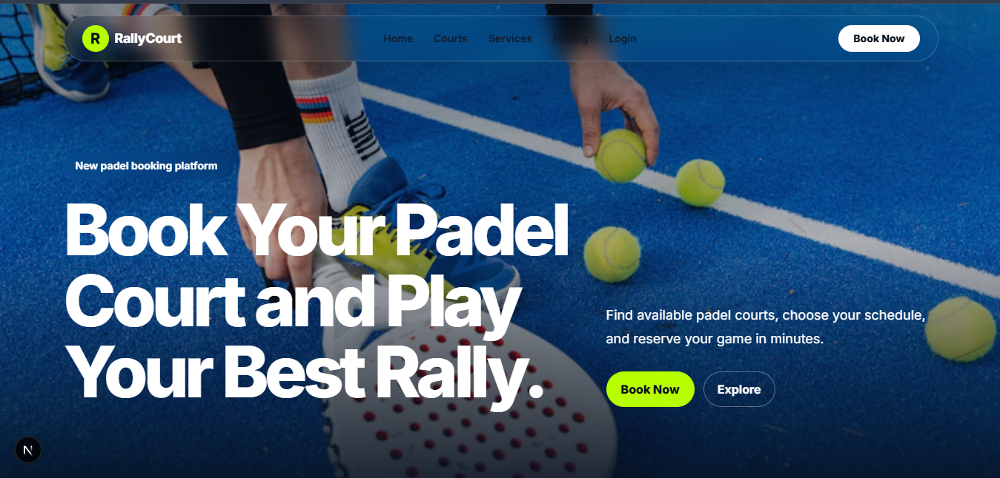
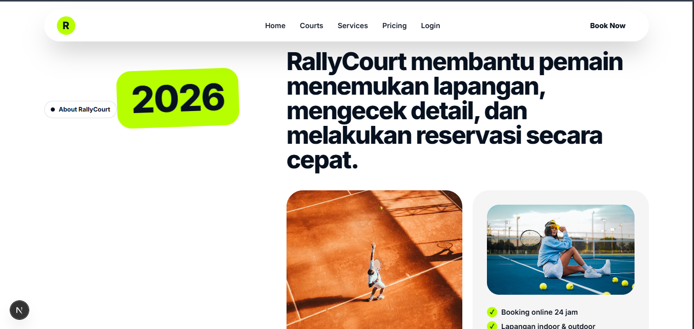
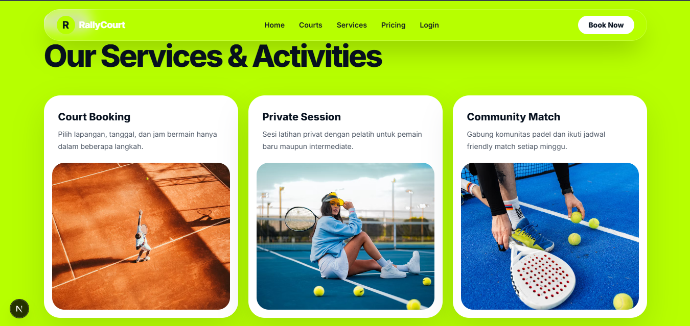
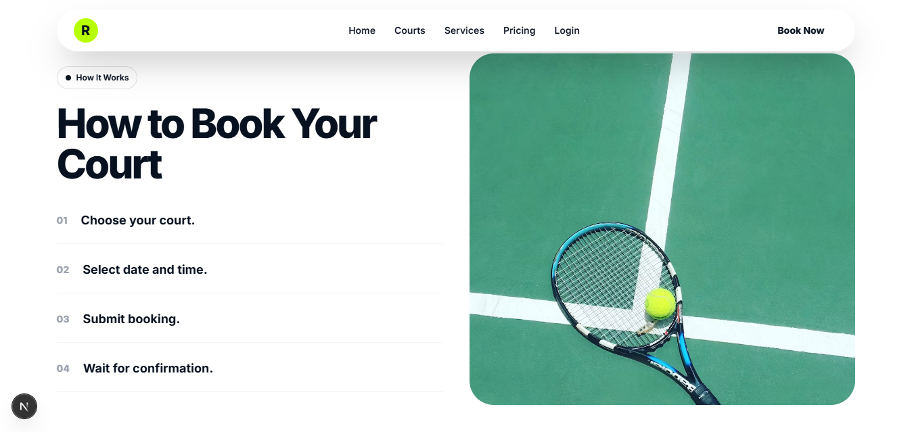
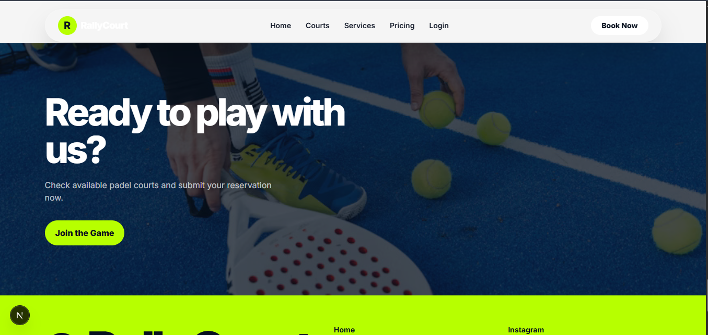
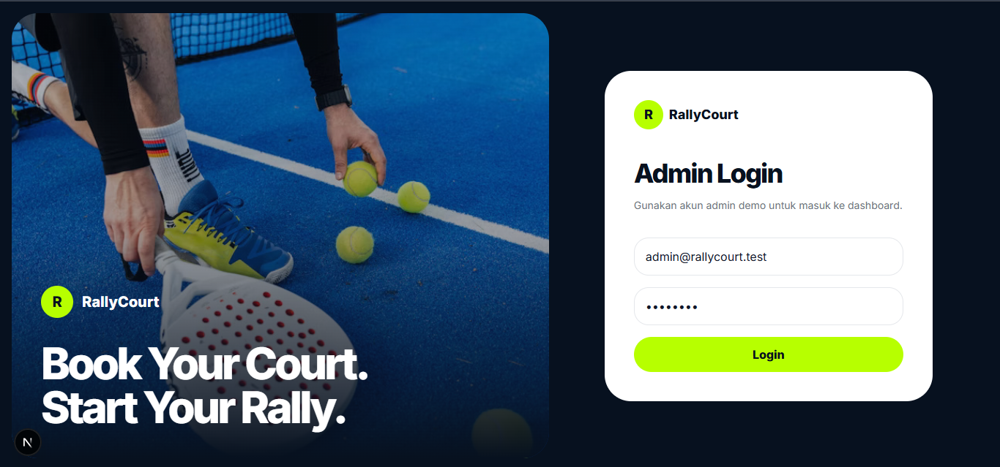
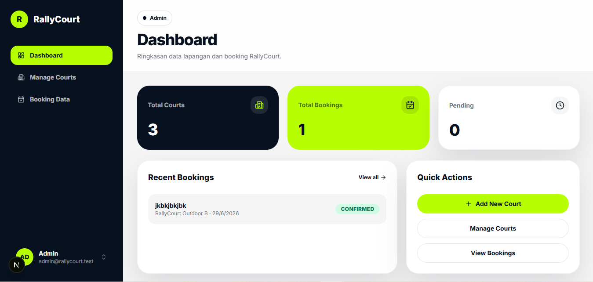

# RallyCourt — Padel Court Booking Platform

> Sistem booking lapangan padel berbasis web, dibangun dengan Next.js, Express.js, dan MySQL.



---

## Deskripsi

RallyCourt adalah aplikasi fullstack untuk reservasi lapangan padel secara online. Pengguna dapat melihat ketersediaan lapangan, memilih jadwal, dan mengirim booking dalam beberapa langkah. Admin dapat mengelola data lapangan dan memantau seluruh transaksi melalui dashboard terpisah.

---

## Teknologi

| Layer    | Stack                       |
| -------- | --------------------------- |
| Frontend | Next.js 15, Tailwind CSS    |
| Backend  | Node.js, Express.js         |
| Database | MySQL (mysql2)              |
| HTTP     | Axios                       |

---

## Fitur

### User
- Melihat landing page & daftar lapangan
- Melihat detail lapangan (tipe, harga, lokasi)
- Melakukan booking lapangan (tanpa akun)

### Admin
- Login admin dengan JWT
- Dashboard statistik (total lapangan, booking, pending)
- CRUD data lapangan (tambah, edit, hapus)
- Lihat semua data booking
- Ubah status booking: `pending` → `confirmed` / `cancelled`

---

## Tampilan









---

## Struktur Project

```
rallycourt-starter/
├── backend/
│   ├── config/
│   │   └── db.js
│   ├── controllers/
│   │   ├── authController.js
│   │   ├── bookingController.js
│   │   └── courtController.js
│   ├── middleware/
│   │   └── authMiddleware.js
│   ├── routes/
│   │   ├── authRoutes.js
│   │   ├── bookingRoutes.js
│   │   └── courtRoutes.js
│   └── server.js
│
├── frontend/
│   ├── components/
│   │   ├── admin/
│   │   │   ├── AdminLayout.js
│   │   │   ├── AdminTopbar.js
│   │   │   ├── BookingsTable.js
│   │   │   ├── CourtForm.js
│   │   │   ├── CourtsTable.js
│   │   │   └── StatCard.js
│   │   ├── ui/
│   │   │   ├── badge.js
│   │   │   ├── button.js
│   │   │   ├── card.js
│   │   │   ├── input.js
│   │   │   ├── label.js
│   │   │   ├── select.js
│   │   │   ├── table.js
│   │   │   └── textarea.js
│   │   ├── AdminSidebar.js
│   │   ├── CourtCard.js
│   │   ├── Footer.js
│   │   ├── Navbar.js
│   │   └── Reveal.js
│   ├── pages/
│   │   ├── admin/
│   │   │   ├── courts/
│   │   │   │   ├── [id]/edit.js
│   │   │   │   ├── create.js
│   │   │   │   └── index.js
│   │   │   ├── bookings.js
│   │   │   └── dashboard.js
│   │   ├── _app.js
│   │   ├── booking.js
│   │   ├── courts.js
│   │   ├── index.js
│   │   └── login.js
│   ├── public/
│   │   └── images/
│   ├── services/
│   │   └── api.js
│   └── styles/
│       └── globals.css
│
├── database/
│   └── rallycourt_db.sql
│
└── docs/
    └── screenshots/
```

---

## Instalasi & Menjalankan

### 1. Clone repository

```bash
git clone https://github.com/username/rallycourt-starter.git
cd rallycourt-starter
```

### 2. Import database

Buka phpMyAdmin atau MySQL CLI, lalu:

```sql
CREATE DATABASE rallycourt_db;
```

Import file `database/rallycourt_db.sql`.

### 3. Setup Backend

```bash
cd backend
npm install
npm run dev
# Server berjalan di http://localhost:5000
```

Buat file `backend/.env`:

```env
DB_HOST=localhost
DB_USER=root
DB_PASSWORD=
DB_NAME=rallycourt_db
JWT_SECRET=rahasia_jwt_kamu
```

### 4. Setup Frontend

```bash
cd frontend
npm install
npm run dev
# Aplikasi berjalan di http://localhost:3000
```

---

## API Endpoints

### Courts
| Method | Endpoint           | Deskripsi             |
| ------ | ------------------ | --------------------- |
| GET    | /api/courts        | Ambil semua lapangan  |
| GET    | /api/courts/:id    | Detail lapangan       |
| POST   | /api/courts        | Tambah lapangan       |
| PUT    | /api/courts/:id    | Update lapangan       |
| DELETE | /api/courts/:id    | Hapus lapangan        |

### Bookings
| Method | Endpoint                  | Deskripsi             |
| ------ | ------------------------- | --------------------- |
| GET    | /api/bookings             | Ambil semua booking   |
| POST   | /api/bookings             | Buat booking baru     |
| PUT    | /api/bookings/:id/status  | Update status booking |
| DELETE | /api/bookings/:id         | Hapus booking         |

### Auth
| Method | Endpoint           | Deskripsi   |
| ------ | ------------------ | ----------- |
| POST   | /api/auth/login    | Login       |
| POST   | /api/auth/register | Register    |

---

## Akun Demo Admin

```
Email    : admin@rallycourt.test
Password : admin123
```

---

## Database

**Tabel utama:**
- `users` — data pengguna & admin
- `courts` — data lapangan (nama, tipe, harga, lokasi)
- `bookings` — transaksi booking beserta status

---

## Developer

| | |
|---|---|
| **Nama** | Hilman Ardiansyah |
| **NPM** | 23552011280 |
| **Kelas** | TIF RM 23B ONLINE |
| **Mata Kuliah** | Pemrograman Web |

---

## Lisensi

Project ini dibuat untuk keperluan akademik. Bebas digunakan sebagai referensi belajar.
